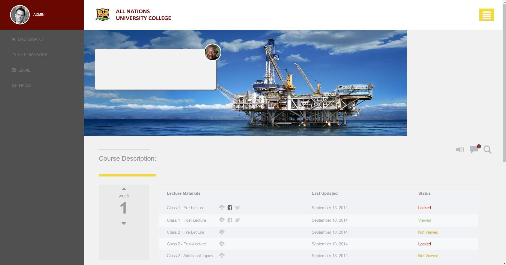

# Modular CSS (SASS Rebuild)

### Overview
This website is the eEdu Student Portal SASS Rebuild site. For this site, I have sorted the css into different modules and compressed them into a master.css file using SASS. 

### Getting Started
This is a basic HTML / CSS build.

To view the page, clone this to the location of your choice, and open the ".html" file.

You can also view the source code by opening it in any code editing program of your choice, or clicking inspect in a chrome tab.

### Prerequisites
All you need to run this page is an up to date browser.

## Authors
1. Greg Avery - developer
